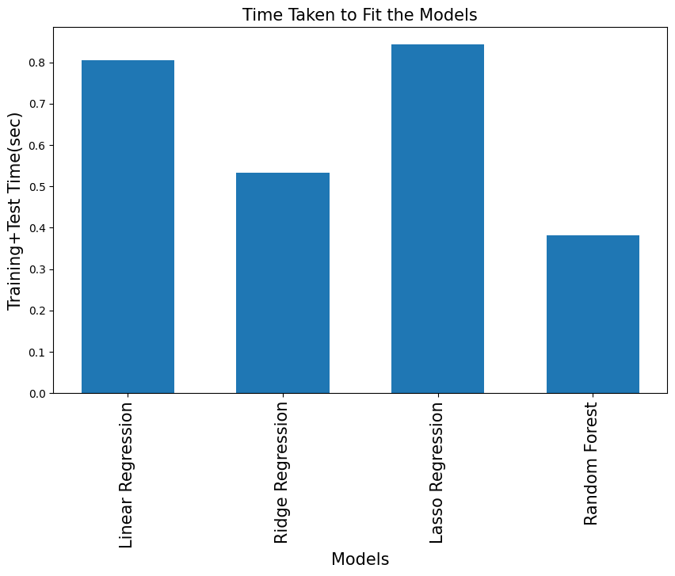

# E-commerce Sales Analysis and Prediction

## Abstract
E-commerce is the new way of shopping in this new era, especially in a covid pandemic when people are unable to walk outside but still want to shop. As a result, online shopping has become a popular option for customers, and it is useful to forecast e-commerce sales volume. So, the main objective of the project is to build the prediction model and try to develop special sales. In this project, I applied different machine learning algorithms such as Linear Regression, Ridge Regression, Lasso Regression, Random Forest, for the dataset and find out the algorithm which fits this dataset. Taken RMSE evaluation parameter to find the performance of the models. For this project, I used Jupiter Notebook (Anaconda Navigator) User Interface where I will use python to build the models.

## Project Overview
In this new era, e-commerce has become a significant shopping trend. Customers' information is acquired in bulk by online retailers, who store it in a database for future use. Online Retail evaluated the data and its pattern throughout the year. With access to such a massive amount of data, E-Commerce will be able to create a game-changing environment for the E-Commerce firm. This industry has spent hundreds of millions of dollars on advertising, social media, data sorting, and other methods to increase sales, but they did not anticipate that machine learning would help them outperform their competition. Data mining, artificial intelligence, augmented reality, and prediction is just a few of the specializations in machine learning. The e-commerce platform will be able to make better business decisions if it can estimate income for the following month or day. They will be able to observe and analyze sales trends if a festival or event occurs yearly. I tried different machine learning approaches in this project, including Linear Regression, Ridge Regression, Lasso Regression, and Random Forest, to determine which one best matches the data. To determine the performance of the models, the RMSE evaluation parameter was used.

## Dataset
- **Source**: Online Retail Dataset (UCI Machine Learning Repository)
- **Size**: 541,909 rows, 8 columns
- **About Data**: The dataset includes several columns: `InvoiceNo`, which is a unique transaction ID; `StockCode`, serving as the product identifier; `Description`, providing details about the product; `Quantity`, indicating the number of units purchased; `InvoiceDate`, which is the timestamp of the transaction; `UnitPrice`, representing the price per unit of the product; `CustomerID`, a unique identifier for customers; and `Country`, denoting the country of purchase.

### Sample Data
```
  InvoiceNo StockCode                          Description  Quantity  
0    536365    85123A   WHITE HANGING HEART T-LIGHT HOLDER         6   
1    536365     71053                  WHITE METAL LANTERN         6   
2    536365    84406B       CREAM CUPID HEARTS COAT HANGER         8   
3    536365    84029G  KNITTED UNION FLAG HOT WATER BOTTLE         6   
4    536365    84029E       RED WOOLLY HOTTIE WHITE HEART.         6   
```
## Methods
For this project, I used Jupiter Notebook (Anaconda Navigator) User Interface where I will use python to build the machine learning models. I split the project into four phases.
(1) Data Pre-processing
(2) To analyze the bestselling product, need to use the aggregation function on quantity and find out the total price of products.
(3) By using a heatmap from the seaborn library to analyze the correlation between features.
(4) Splitting the data
(5) Based on parameter RMSE identify the best model
(6) Predicting the Sales

## Data Preprocessing
- **Handling missing values**: Removed or imputed missing `CustomerID`
- **Feature Engineering**: Extracted date features from `InvoiceDate`
- **Data Normalization**: Standardized numerical features for better model performance

## Exploratory Data Analysis (EDA)
- **Top Selling Products**: Identified most frequently purchased items
- **Customer Segmentation**: Clustered customers based on spending behavior
- **Sales Trends**: Analyzed seasonal patterns and peak purchasing times

## Machine Learning Models Used:
- **Linear Regression**
- **Random Forest Regressor**
- **Lasso Regression**
- **Ridge Regression**

### 📌 Model Evaluation Metrics while Training and Testing:
Different machine learning models were evaluated based on their fitting time. Some models showed significantly faster processing times, indicating efficiency in handling e-commerce datasets.

| Model                     | CPU Time | Train Root Mean Squared Error (RMSE) | Test Root Mean Squared Error (RMSE) | R² Score |
|---------------------------|----------|--------------------------------------|-------------------------------------|----------|
| Linear Regression         | 46.9     | 21.54                                | 18.09                                   | 0.84     |
| Ridge Regression          | 31.2     | 21.59                                | 18.09                                   | 0.53     |
| Lasso Regression          | 93.8     | 21.59                                | 18.09                                   | 0.84     |
| Gradient Boosting Regressor | 24     | 18.80                                | 13.87                                   | 0.38     |



## Visualization & Reports
This project analyzes e-commerce sales data through various visualizations and insights, helping to understand trends in customer behavior, product demand, and regional transactions.

#### Daily Orders Trend
The number of daily orders fluctuates, with noticeable peaks and troughs over different months. There are variations across weeks, indicating demand shifts.


#### Heatmap Analysis
A correlation heatmap was generated to identify relationships between different variables. Key insights show strong dependencies between order counts and time-related factors.


#### Monthly Order Counts
Orders peak in specific months, particularly at the end of the year, likely due to holiday seasons and promotions. There is a significant variation in demand across different months.


#### Most Common Customers
The most frequent customers placed thousands of orders, with the highest reaching over 17,841 transactions. The top 10 customers significantly contribute to total sales.


#### Top 10 Countries with Highest Transactions
The dataset highlights countries that contribute the most to transactions. Some countries dominate in terms of the number of orders.


#### Top 10 Best-Selling Products
Certain products are consistently the most sold, driving revenue and demand. The top products exceed 100,000 sales, showcasing their popularity.


#### Weekly Order Distribution
Weekly order trends show fluctuations, with some periods experiencing spikes. Understanding these patterns helps in inventory and supply chain management.


This analysis provides a data-driven approach to understanding e-commerce sales patterns. The insights can help in improving business strategies, optimizing product stock, and enhancing customer retention.

## Key Insights
- The **Random Forest Regressor** performed best in sales prediction with an **R² score of 0.89**.
- **Sales peaked during holiday seasons**, indicating strong seasonal effects.
- A **small percentage of customers contributed to a large portion of sales**, emphasizing the importance of customer loyalty programs.

## How to Run
### Prerequisites
```bash
pip install -r requirements.txt
```
### Running the Notebook
```bash
jupyter notebook "E-commerce Sales Prediction.ipynb"
```

## License
This project is open-source under the MIT License.

---
 **Author**: [Pratik]  
